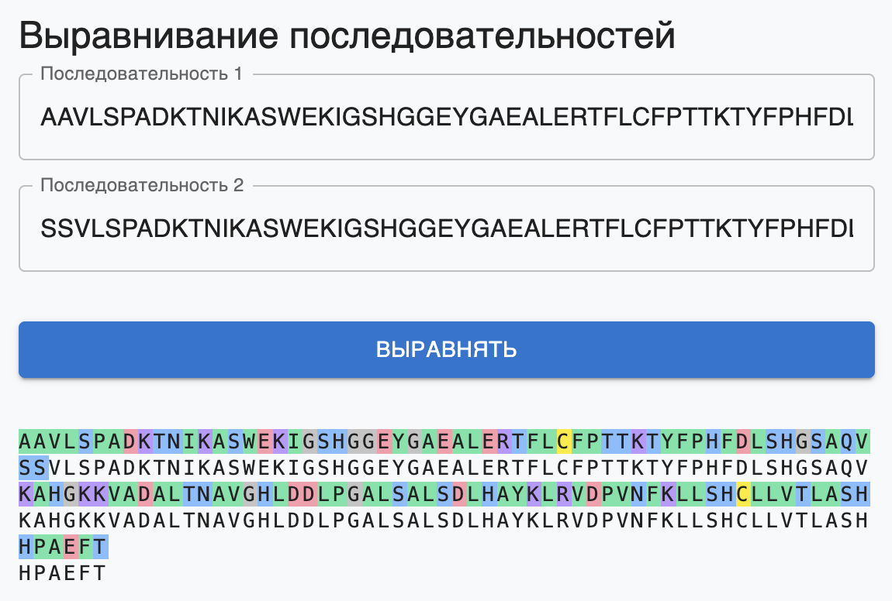

# 🔬 Biocad Alignment Tool

Интерактивный инструмент для визуализации выравнивания аминокислотных последовательностей.  
Проект реализован на [React](https://react.dev/), [TypeScript](https://www.typescriptlang.org/) и [Vite](https://vitejs.dev/).



## 🚀 Демо

Доступен по адресу:  
👉 [https://xxxmez.github.io/biocad-alignment-tool](https://xxxmez.github.io/biocad-alignment-tool)

## ⚙️ Установка

```bash
git clone https://github.com/xxxmez/biocad-alignment-tool.git
cd biocad-alignment-tool
npm install
```
